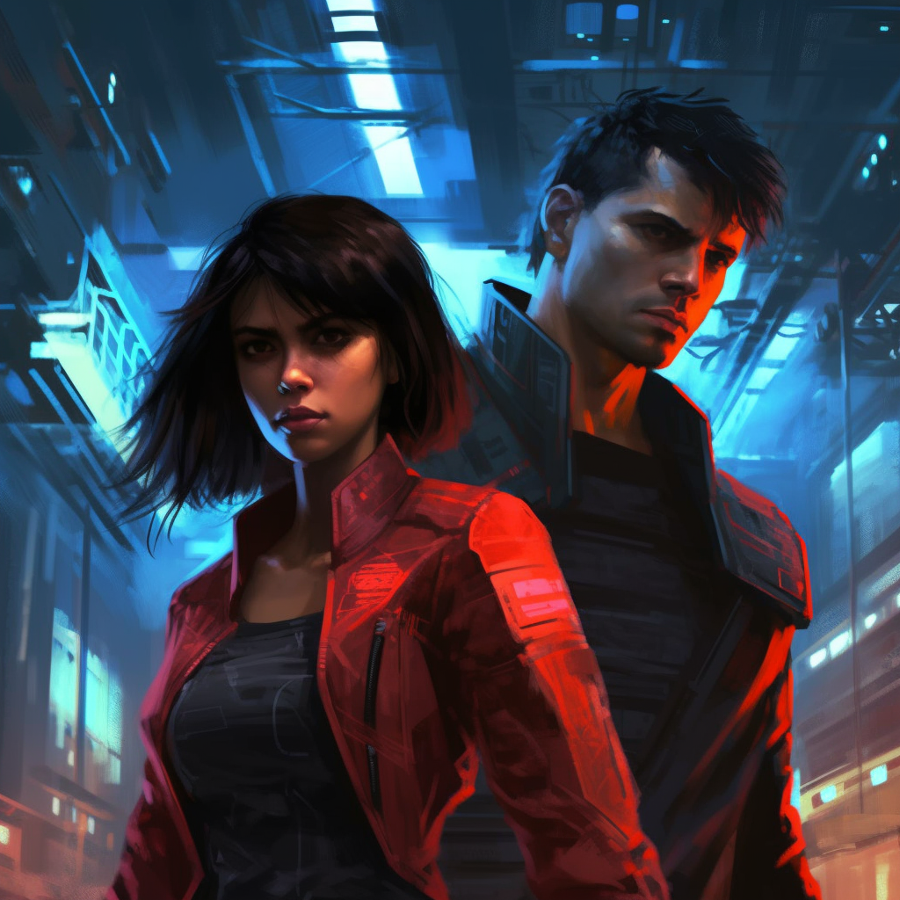

## Cyberpunk World

<!-- add image -->

In the neon-drenched streets of the cyberpunk world, life is a constant struggle for survival and power. The divide between the wealthy elite, who live in towering megacities and control the flow of information and resources, and the impoverished masses in the underbelly of society, is stark and unforgiving. The cityscape is a maze of holographic billboards, dark alleyways, and high-tech streets, where the rich flaunt their cybernetic enhancements and the poor scrape by with outdated tech. Corporate greed, rampant surveillance, and corrupt governments fuel the constant unrest, while rebel factions, hackers, and mercenaries navigate the urban sprawl, challenging the status quo and seeking their own survival in a world dominated by artificial intelligence, cybernetics, and virtual realities.

For most, life is an endless cycle of work, rebellion, and escape. Street gangs and corporate hit squads rule the lower levels, while tech-augmented individuals known as "runners" take on dangerous jobs, from data heists to sabotage missions, in exchange for cash or critical resources. In this dystopian world, identity is fluid, shaped by implants, body modifications, and the digital world, where everyone is constantly plugged into the Net. The pursuit of freedom and power drives individuals to defy the corporations, challenge the system, and explore the uncharted territories of cyberspace, risking everything for a glimpse of a better life—or to simply stay alive in a world that has long since forgotten what it means to be human.
